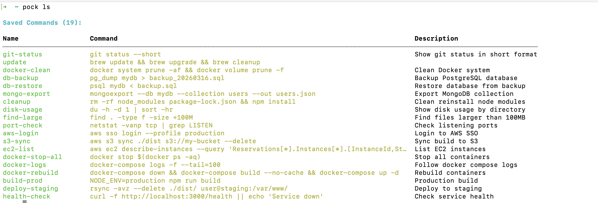

# copilothub

Extensible AI-powered developer toolbox that runs as a local CLI and opens a browser-based hub. Built-in features include spec analysis and a project knowledge base; external plugins can be installed from GitHub.



## Features

### Built-in

| Feature          | Description                                                                                              |
| ---------------- | -------------------------------------------------------------------------------------------------------- |
| **Spec Clarify** | Analyze a spec/requirement against source code or a wiki to surface gaps, conflicts, and ambiguities     |
| **Wiki**         | Chat with your project knowledge base; upload PDF/MD/DOCX files that are indexed by a local vector store |

### Plugin system

External plugins can be installed from GitHub. They run as separate subprocesses and are reverse-proxied by the hub.

```bash
copilothub install <github-url>   # install a plugin
copilothub uninstall <id>         # remove a plugin
copilothub list                   # list installed plugins
```

## Prerequisites

- [Go](https://golang.org/) 1.21+
- [Node.js](https://nodejs.org/) 18+
- [GitHub CLI (`gh`)](https://cli.github.com/) — authenticated (`gh auth login`) for Copilot access

## Installation

### From source

```bash
git clone https://github.com/your-org/copilothub
cd copilothub
make install          # builds frontend + Go binary, copies to /usr/local/bin
```

### Build only (no install)

```bash
make build            # outputs bin/copilothub
```

## Usage

```bash
# Open the hub UI for the current repository
copilothub open

# Specify a port (default: 3000)
copilothub open --port 8080

# Target a different directory
copilothub open --workdir /path/to/repo
```

The browser opens automatically at `http://localhost:3000`.

## Development

Run the frontend dev server and Go backend in separate terminals:

```bash
# Terminal 1 — Vite hot-reload (proxies API to :3000)
cd web && npm run dev

# Terminal 2 — Go API server
go run . open
```

The knowledge sidecar (ChromaDB) is started automatically by the Wiki feature when `knowledge.enabled` is set to `true` in config. To run it manually:

```bash
make knowledge-deps   # install Python dependencies (one-time)
make dev-knowledge    # start sidecar on http://localhost:8001
```

## Knowledge base (PDF/MD/DOCX)

Managed through the **Wiki** feature:

- Supported file types: `.pdf`, `.md`, `.docx`
- Uploaded files are stored in `.spec-designer/knowledge/files/` inside the target repository
- Vectors are persisted to `.spec-designer/chroma/` via the local Python sidecar (`python/knowledge_service`)
- Embeddings use `sentence-transformers/paraphrase-multilingual-MiniLM-L12-v2`

The sidecar auto-starts when `knowledge.enabled = true` in `.copilothub/config.json`. To override the sidecar port when running it manually:

```bash
CHROMA_DIR=/path/to/chroma_db make dev-knowledge
```

## Project structure

```
.
├── cmd/                      CLI commands (open, install, uninstall, list)
├── internal/
│   ├── ai/                   GitHub Copilot SDK integration
│   ├── config/               Per-repo config (.copilothub/config.json)
│   ├── features/
│   │   ├── specclarify/      Spec Clarify feature (clarify, refine, fetch-wiki)
│   │   ├── specdesigner/     Knowledge upload handler (used by Spec Designer)
│   │   └── wiki/             Wiki feature (chat, knowledge upload/list/delete)
│   ├── handler/              Hub-level HTTP handlers (hub, repo, config)
│   ├── hub/                  Feature interface, registry, external plugin proxy
│   ├── knowledge/            Python sidecar launcher + HTTP client
│   ├── repo/                 Git repository scanner
│   └── server/               HTTP server, routing, embedded frontend
├── python/
│   └── knowledge_service/    FastAPI + LangChain + ChromaDB sidecar
├── web/                      Vue 3 frontend (Vite + TypeScript + Tailwind + reka-ui)
│   └── src/
│       ├── features/
│       │   ├── spec-clarify/ EditorPage, ConfigDialog
│       │   ├── spec-designer/KnowledgePanel
│       │   └── wiki/         WikiPage
│       ├── hub/              HubHome (feature list)
│       ├── stores/           Pinia stores (knowledge, repo)
│       └── api/              Typed fetch wrappers
└── Makefile
```

## Configuration

Settings are stored in `.copilothub/config.json` within the target repository. Override the AI token via environment variable:

```bash
GITHUB_TOKEN=ghp_xxx copilothub open
```

## Makefile targets

| Target                         | Description                                   |
| ------------------------------ | --------------------------------------------- |
| `make build`                   | Build frontend + Go binary                    |
| `make build-frontend`          | Build only the Vite frontend                  |
| `make install`                 | Build and install to `/usr/local/bin`         |
| `make knowledge-deps`          | Install Python knowledge sidecar dependencies |
| `make dev-knowledge`           | Run knowledge sidecar on port 8001            |
| `make knowledge-setup-and-run` | Install deps and start sidecar in one step    |
| `make clean`                   | Remove build artifacts                        |
| `make deps`                    | Download Go dependencies                      |
| `make fmt`                     | Format Go source files                        |
